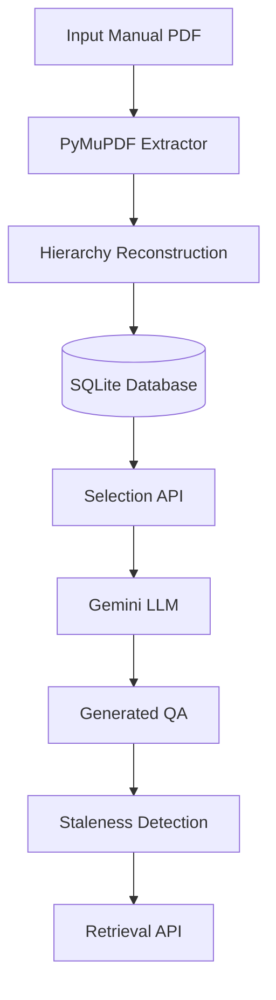

# Assignment Approach Document

**Project Name**: Tri9T AI Engineering Assignment  
**Document**: Architecture, Parser Pipeline, Versioning, REST APIs & LLM Integration  

---

## Cover Page

**Prepared by**:  
B Karna  
BE Computer Science and Engineering  
CMR Institute of Technology  

**Status**:  
Final Submission  

**Date**: July 2026  

---

## Table of Contents
1. [System Architecture](#1-system-architecture)
2. [OCR / PDF Parsing Approach](#2-ocr--pdf-parsing-approach)
3. [Initial Parser Failure & Bounding-Box Filtering](#3-initial-parser-failure--bounding-box-filtering)
4. [Hierarchy Reconstruction & Parent-Child Assembly](#4-hierarchy-reconstruction--parent-child-assembly)
5. [Structural Inconsistencies & Debugging Methodology](#5-structural-inconsistencies--debugging-methodology)
6. [Validation Methodology](#6-validation-methodology)
7. [Document Versioning & Version Matching Strategy](#7-document-versioning--version-matching-strategy)
8. [API Documentation](#8-api-documentation)
9. [LLM Prompt Strategy, Structured Validation & Retry Logic](#9-llm-prompt-strategy-structured-validation--retry-logic)
10. [Staleness Detection & Traceability](#10-staleness-detection--traceability)
11. [Unit Tests Description](#11-unit-tests-description)
12. [Known Limitations & Future Improvements](#12-known-limitations--future-improvements)
13. [Decision Log](#13-decision-log)

---

## 1. System Architecture

The workflow routes a document from a raw PDF manual through extraction, tree reconstruction, version matching, highlight mapping, LLM QA generation, and change verification.



---

## 2. OCR / PDF Parsing Approach

The parser utilizes **PyMuPDF** (`fitz`) for layout extraction.

- **Text Extraction**: Extracts textual elements along with structural details including font sizes, weights, and coordinate bounding boxes.
- **Table Extraction**: Employs PyMuPDF's tabular analysis engine to isolate borders and extract cells.
- **OCR Fallback**: If a page yields no text characters, the parser renders the page as a high-resolution image and passes it to **Tesseract OCR** via `pytesseract`.

---

## 3. Initial Parser Failure & Bounding-Box Filtering

### The Initial Failure
During initial manual testing, the parser duplicated table data. Text from cells was extracted twice: once as standard text blocks and again as structured table elements.

### The Fix
To address this, bounding-box based filtering was introduced. The parser tracks all detected table bounding boxes per page. Before extracting standard text blocks, the parser calculates the centroid of each block. If the centroid falls inside any table region, the text block is excluded from paragraph extraction.

### Result
This resolved duplicate table data while preserving reading order.

---

## 4. Hierarchy Reconstruction & Parent-Child Assembly

The parser processes flat elements and reconstructs parent-child trees using heading indices:

- **Heading Level Detection**:
  - Headings are parsed for dot-delimited numbering (e.g. `2.1.1.1`). The dot count directly sets the nesting depth (e.g. `2.1.1.1` represents level 4, child of `2.1.1`).
  - For unnumbered headings, hierarchy is inferred using font size and weight mappings.
- **Nesting Stack**:
  - A stack keeps track of current parent nodes. 
  - For a new heading of level $L$, the stack is popped until the top element is at level $L-1$. That element is registered as the parent, and the new heading is pushed onto the stack.
  - If a structural gap is detected (e.g., jumping from level 1 to level 3), the parser logs a `HierarchyWarning` and attaches the node to the closest available parent.
- **Reading Flow**:
  - Non-heading nodes (paragraphs, lists, tables) are nested under the heading currently on top of the stack.

---

## 5. Structural Inconsistencies & Debugging Methodology

### Inconsistencies Discovered
- **Out-of-Order Headings**: Headings occasionally appear out of numerical sequence (e.g., section `3.4` preceding `3.3` to show a notes layout), which can disrupt stack-based nesting.
- **Page Break Splits**: Paragraphs split across page breaks were originally parsed as separate blocks.
- **OCR Mismatches**: OCR scans sometimes lose table cell borders, merging rows into single strings.

### Debugging Methodology
- **Raw Block Dumps**: Scripts were written to print layout blocks with coordinate values.
- **Validation Diffs**: Structural elements in the SQLite tables were compared against the original PDF layout.
- **Logging**: Warning levels (`HierarchyWarning`) were added to capture hierarchy gaps without stopping execution.

---

## 6. Validation Methodology

We established a comprehensive validation process to ensure the accuracy of the parsing, database, and API layers:

1. **Manual Comparison**: We compared extracted tables, paragraphs, and lists against the original PDF manual page-by-page.
2. **Visual Inspection**: Bounding box coordinates were plotted over PDF page renders to verify table boundary detection.
3. **Hierarchy Verification**: Validated parent-child linkages in SQLite to ensure no nodes were orphaned.
4. **Reading-Order Validation**: Inspected node position indices (`position`) to verify that the reconstructed text flow matches reading order.
5. **Version Comparison**: Verified that the version matching service correctly maps matching nodes while identifying added, modified, or removed sections.
6. **Unit and Integration Tests**: Ran 33 tests verifying database integrity, PDF extraction, hierarchy logic, and API route responses.

---

## 7. Document Versioning & Version Matching Strategy

### Strategy
Re-ingesting a document creates a new `DocumentVersion` with new physical `Node` rows. To trace historical user selections, the system maps logical identities across versions:
- **Heading Paths**: Unique paths (e.g. `/Section 1/Subsection 1.2/Paragraph 4`) are computed for every node.
- **Similarity Mapping**: If heading paths shift due to renumbering, the matching engine pairs nodes using content similarity, heading titles, and parent linkages.
- **Match States**:
  - `Unchanged`: Content hash is identical.
  - `Modified`: Content hash has changed, logical ID is preserved.
  - `Added`: A new node is introduced in the new version.
  - `Removed`: A node from the original version is deleted.

### Failure Modes
- **Structural Reorganisation**: If sections are heavily restructured, the matching engine may fail to map logical nodes, generating false `Added`/`Removed` statuses.
- **Short Common Headings**: Generic headings like "Notes" can lead to incorrect matching mappings.

---

## 8. API Documentation

### Browse API

#### `GET /api/v1/documents`
- **Purpose**: Retrieves a paginated list of root documents.
- **Request**: Query parameters: `page` (default 1), `size` (default 10).
- **Response**:
  ```json
  {
    "items": [
      {
        "id": "e21184e1-616f-4639-ad8e-2230e6eca799",
        "name": "CT-200 Technical Specs",
        "created_at": "2026-07-17T08:25:35Z",
        "updated_at": "2026-07-17T08:25:35Z"
      }
    ],
    "total": 1,
    "page": 1,
    "size": 10
  }
  ```

#### `GET /api/v1/versions`
- **Purpose**: Retrieves a paginated list of document versions.
- **Request**: Query parameters: `document_id` (optional filter), `page` (default 1), `size` (default 10).
- **Response**:
  ```json
  {
    "items": [
      {
        "id": "3e9b110e-8fb8-410a-b31a-f74f553c81ed",
        "document_id": "e21184e1-616f-4639-ad8e-2230e6eca799",
        "version_number": 1,
        "commit_message": "Specs V1",
        "created_at": "2026-07-17T08:25:35Z"
      }
    ],
    "total": 1,
    "page": 1,
    "size": 10
  }
  ```

#### `GET /api/v1/nodes/{id}`
- **Purpose**: Retrieves details for a specific node by its physical UUID.
- **Request**: Path parameter `{id}` (UUID).
- **Response**:
  ```json
  {
    "id": "7649d211-1a3b-4876-9c47-cb7a8b9e4871",
    "logical_id": "28fb4f1a-b3e8-466d-9781-a98e874f67bf",
    "version_id": "3e9b110e-8fb8-410a-b31a-f74f553c81ed",
    "parent_id": "18f890f8-c103-4212-a720-b471cc7ed48d",
    "node_type": "paragraph",
    "content": "System power supply is 24V DC.",
    "content_hash": "a4d3e8...",
    "position": 0
  }
  ```

---

### Search API

#### `GET /api/v1/search`
- **Purpose**: Searches node contents using case-insensitive SQL `ilike` filters.
- **Request**: Query parameters: `q` (minimum 1 char), `page` (default 1), `size` (default 10).
- **Response**:
  ```json
  {
    "items": [
      {
        "id": "7649d211-1a3b-4876-9c47-cb7a8b9e4871",
        "logical_id": "28fb4f1a-b3e8-466d-9781-a98e874f67bf",
        "version_id": "3e9b110e-8fb8-410a-b31a-f74f553c81ed",
        "parent_id": "18f890f8-c103-4212-a720-b471cc7ed48d",
        "node_type": "paragraph",
        "content": "System power supply is 24V DC.",
        "content_hash": "a4d3e8...",
        "position": 0
      }
    ],
    "total": 1,
    "page": 1,
    "size": 10
  }
  ```

---

### Selection API

#### `POST /api/v1/selection`
- **Purpose**: Creates a user selection highlight pinned to a version.
- **Request**:
  ```json
  {
    "version_id": "3e9b110e-8fb8-410a-b31a-f74f553c81ed",
    "node_ids": ["7649d211-1a3b-4876-9c47-cb7a8b9e4871"],
    "name": "Power specs highlight"
  }
  ```
- **Response**:
  ```json
  {
    "id": "9d8e7c6b-5a4f-3e2d-1c0b-9a8f7e6d5c4b",
    "document_id": "e21184e1-616f-4639-ad8e-2230e6eca799",
    "version_id": "3e9b110e-8fb8-410a-b31a-f74f553c81ed",
    "name": "Power specs highlight",
    "node_ids": ["7649d211-1a3b-4876-9c47-cb7a8b9e4871"],
    "created_at": "2026-07-17T08:26:00Z"
  }
  ```

#### `GET /api/v1/selection/{id}`
- **Purpose**: Retrieves a specific selection highlight by its UUID.
- **Request**: Path parameter `{id}` (UUID).
- **Response**:
  ```json
  {
    "id": "9d8e7c6b-5a4f-3e2d-1c0b-9a8f7e6d5c4b",
    "document_id": "e21184e1-616f-4639-ad8e-2230e6eca799",
    "version_id": "3e9b110e-8fb8-410a-b31a-f74f553c81ed",
    "name": "Power specs highlight",
    "node_ids": ["7649d211-1a3b-4876-9c47-cb7a8b9e4871"],
    "created_at": "2026-07-17T08:26:00Z"
  }
  ```

---

### Retrieval API

#### `GET /api/v1/generation/{selection_id}`
- **Purpose**: Generates a staleness and diff report for a selection's QA test cases against the current document version.
- **Request**: Path parameter `{selection_id}` (UUID).
- **Response**:
  ```json
  {
    "selection_id": "9d8e7c6b-5a4f-3e2d-1c0b-9a8f7e6d5c4b",
    "original_version": {
      "id": "3e9b110e-8fb8-410a-b31a-f74f553c81ed",
      "version_number": 1,
      "commit_message": "Specs V1",
      "created_at": "2026-07-17T08:25:35Z"
    },
    "current_version": {
      "id": "d5e6f7a8-b9c0-4d1e-2f3a-4b5c6d7e8f9a",
      "version_number": 2,
      "commit_message": "Specs V2",
      "created_at": "2026-07-17T08:26:30Z"
    },
    "staleness_status": "Possibly stale",
    "test_cases": [
      {
        "id": "b1a2c3d4-e5f6-7a8b-9c0d-1e2f3a4b5c6d",
        "question": "What is the system power supply voltage?",
        "answer": "24V DC.",
        "status": "Possibly stale",
        "reason": "Content of source node (logical ID 28fb4f1a-b3e8-466d-9781-a98e874f67bf) was modified in current version.",
        "diff_summary": "--- Original\n+++ Current\n@@ -1 +1 @@\n-System power supply is 24V DC.\n+System power supply is 12V DC."
      }
    ]
  }
  ```

#### `GET /api/v1/generation/node/{node_id}`
- **Purpose**: Returns the staleness and diff reports for all selections containing the specified node.
- **Request**: Path parameter `{node_id}` (UUID).
- **Response**: List of report objects (similar to `/generation/{selection_id}`).

---

## 9. LLM Prompt Strategy, Structured Validation & Retry Logic

### Prompt Design
The prompt is engineered for Google's Gemini 1.5 models. It provides strict instructions to return a JSON payload matching the requested schema.

### Structured Validation
FastAPI processes raw string outputs. The system parses and validates the JSON output using the Pydantic schema model `QATestCaseList`.

### Retry Strategy
- If validation fails (e.g. malformed JSON returned), the system catches the error, appends the error details to the prompt, and retries the call once.
- If the second attempt fails, it logs the error, saves it to the `llm_failure_logs` table, and returns a 500 server error to the client.

---

## 10. Staleness Detection & Traceability

The system traces generated test cases against the latest document version:
- **`Fresh`**: All original logical nodes exist in the current version and their current content hashes match the generation-time hashes exactly (no text changed).
- **`Possibly stale`**: All original logical nodes exist in the current version but one or more of their content hashes have changed (the text content was modified, so the test case might still be valid but needs QA verification). A unified diff is computed to show changes.
- **`Stale`**: One or more of the original logical nodes no longer exist in the current version (deleted sections).

---

## 11. Unit Tests Description

We implemented 33 unit and integration tests under `tests/` to verify critical assignments requirements:

1. **Deep Hierarchy Validation (`2.1.1.1`)**: Verifies headings down to level 4 are correctly nested under parent headings.
2. **Duplicate Headings Identification**: Verifies that identical section titles create distinct database records with unique physical IDs.
3. **Reading Order Preservation (`3.4` before `3.3`)**: Verifies that document parsing preserves layout order regardless of heading numbering.
4. **Table Extraction**: Verifies that tables are correctly isolated from surrounding paragraph text blocks.
5. **Version Matching**: Verifies stable logical ID mappings and renumbering shifts across version diffing checks.

---

## 12. Known Limitations & Future Improvements

### Limitations
- **Format-Driven Staleness**: Non-semantic modifications (e.g. adding a trailing space or comma) will change the hash, flagging the node as "Possibly stale".
- **Context Blindness**: If a node is unchanged (same hash) but neighboring warnings are added, the node is marked "Fresh" even though it is semantically stale.
- **Complex Table Grids**: Borderless tables can occasionally cause cell alignments to overlap.

### Future Improvements
- **Semantic Similarity Mapping**: Use sentence-transformer embeddings to detect if text changes alter semantic meaning instead of using raw hashes.
- **OCR Enhancements**: Use visual layout detectors on image documents.
- **Resolution Workflows**: Implement APIs to allow users to update stale test cases.

---

## 13. Decision Log

### 1. What is the one part of this system most likely to silently give wrong results without erroring? How would you detect it?
The **hierarchy reconstruction tree builder** component is the most likely to silently produce incorrect results. If a heading level index is malformed or out of numerical order in a subtle way, the stack-based nesting algorithm might attach text nodes to incorrect parent headings without raising a database or python execution exception.
- *Detection*: We check the `HierarchyWarning` logs emitted during parsing. We can also run post-parsing validations to verify parent-child linkages against reading order coordinates.

### 2. Where did you choose simplicity over correctness because of time? What would break first if this went to production?
We chose **hash-based staleness detection** (comparing content hashes exactly) instead of semantic parsing (e.g. LLM-based verification).
- *Failure Mode*: If deployed, formatting changes (such as fixing a typo or adding a space) would change the hash, flagging the nodes as "Possibly stale". This would generate false positives, requiring manual review for semantically identical text.

### 3. Name one input (parser, version matcher, or LLM call) that your implementation does NOT handle. What happens when it encounters it?
The parser does not handle **PDF page layouts containing multi-column text mixed with spanning tables**.
- *Behavior*: When PyMuPDF encounters spanning tables intersecting two columns, it can read cells out of column order. This results in scrambled text reconstructions and incorrect table data in the database.
